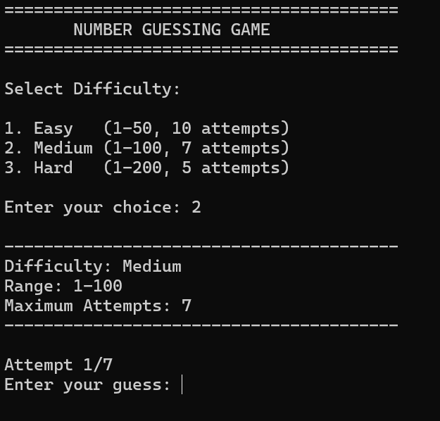
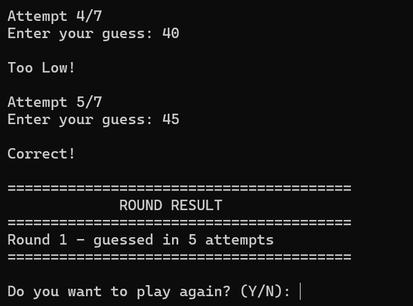
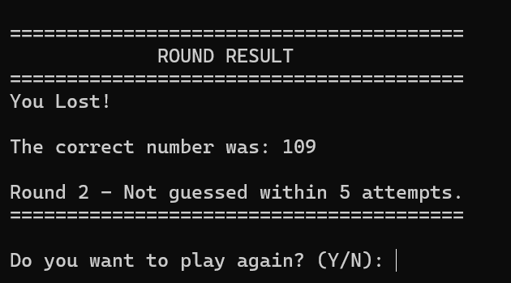

# Number Guessing Game (Java)

A console-based Number Guessing Game built with Core Java. The computer picks a secret number, and the player has a limited number of attempts to guess it. The game supports three difficulty levels, multiple rounds, and a final score summary.

**Internship:** Oasis Infobyte (OIBSIP)
**Domain:** Java Development
**Task:** Task 2 - Number Guessing Game

---

## Features

### Mandatory features
- Random number generated at the start of every round (`java.util.Random`)
- Default range of 1 to 100
- Guesses read using `Scanner`
- Feedback after every guess: `Too High!`, `Too Low!` or `Correct!`
- Attempt counter shown during the game (`Attempt 3/7`)
- Maximum attempt limit (default 7); on failure the game shows `You Lost!` and reveals the correct number
- Play Again option after every round
- Score and history maintained across rounds
- Round summary, for example `Round 1 - guessed in 4 attempts`
- Final game summary (total rounds, wins, losses, per-round history)

### Bonus features
- Three difficulty levels, selectable before every round

| Level  | Number Range | Maximum Attempts |
|--------|--------------|------------------|
| Easy   | 1 - 50       | 10               |
| Medium | 1 - 100      | 7                |
| Hard   | 1 - 200      | 5                |

### Input validation
- Rejects non-numeric input (letters, decimals, empty input)
- Rejects guesses outside the selected range
- Rejects invalid difficulty choices
- Rejects invalid Play Again answers (only Y or N accepted, case-insensitive)
- Invalid input never crashes the program and does not use up an attempt

---

## Technologies Used

- Java (Core Java)
- `Scanner` for input
- `Random` for random number generation
- `while` loops, `if-else`, `switch`, methods and basic OOP

No external libraries or frameworks are used.

---

## How to Run

**Requirements:** Java JDK 8 or higher.

```bash
# 1. Clone the repository
git clone https://github.com/YOUR-USERNAME/OIBSIP.git

# 2. Go to the project folder
cd OIBSIP/Java-Task2-NumberGuessingGame

# 3. Compile (output goes to the out/ folder)
javac -d out src/NumberGuessingGame.java

# 4. Run
java -cp out NumberGuessingGame
```

---

## Sample Output

```
========================================
       NUMBER GUESSING GAME
========================================

Select Difficulty:

1. Easy   (1-50, 10 attempts)
2. Medium (1-100, 7 attempts)
3. Hard   (1-200, 5 attempts)

Enter your choice: 2

----------------------------------------
Difficulty: Medium
Range: 1-100
Maximum Attempts: 7
----------------------------------------

Attempt 1/7
Enter your guess: 50

Too High!

Attempt 2/7
Enter your guess: 25

Too Low!

Attempt 3/7
Enter your guess: 37

Correct!

========================================
             ROUND RESULT
========================================
Round 1 - guessed in 3 attempts
========================================

Do you want to play again? (Y/N): n

========================================
          GAME SUMMARY
========================================

Total Rounds: 1
Rounds Won: 1
Rounds Lost: 0

Round 1 - Won in 3 attempts

Thanks for playing!
```

---

## Code Structure

| Method | Purpose |
|--------|---------|
| `main()` | Runs the game loop and stores round history |
| `displayTitle()` | Prints the game banner |
| `selectDifficulty()` | Shows the menu and returns the chosen difficulty (uses `switch`) |
| `generateRandomNumber()` | Returns a random number within the selected range |
| `playRound()` | Runs one round: guesses, feedback and attempt counting |
| `readInteger()` | Reads and validates numeric input within a range |
| `displayResult()` | Prints the round result (win or loss) |
| `playAgain()` | Asks Y/N with validation |
| `displayFinalSummary()` | Prints total rounds, wins, losses and history |

Two small helper classes keep the code organised:
- `Difficulty` stores the name, range and attempt limit of a level.
- `RoundRecord` stores the result of one finished round.

---

## Edge Cases Handled

- Correct guess on the first attempt
- Correct guess on the final attempt
- Maximum attempts exhausted
- Non-numeric input
- Guess outside the allowed range
- Invalid difficulty selection
- Invalid Play Again input
- Multiple rounds in one session

---

## Project Structure

```
OIBSIP/
└── Java-Task2-NumberGuessingGame/
    ├── src/
    │   └── NumberGuessingGame.java
    ├── screenshots/
    └── README.md
```

---

## Screenshots

> Add your screenshots to the `screenshots/` folder and update the file names below.

| Difficulty Menu | Winning Round |
|-----------------|---------------|
|  |  |

| Losing Round | Input Validation |
|--------------|------------------|
|  |  |

| Game Summary |
|--------------|
|  |

---

## Author

**YOUR FULL NAME**
Java Development Intern at Oasis Infobyte

- LinkedIn: [your-linkedin-url]([https://www.linkedin.com/in/zishankhan](https://www.linkedin.com/in/zishan-khan-97910a290?utm_source=share_via&utm_content=profile&utm_medium=member_android))
- GitHub: [your-github-username](https://github.com/ZishanKhan4040)

#oasisinfobyte #OIBSIP
